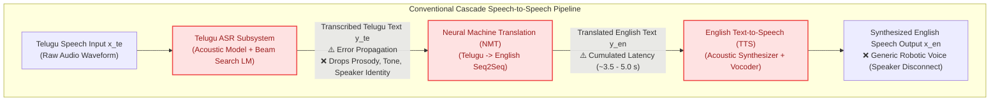
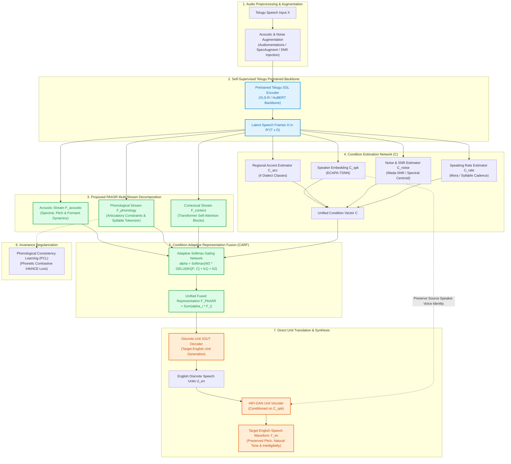
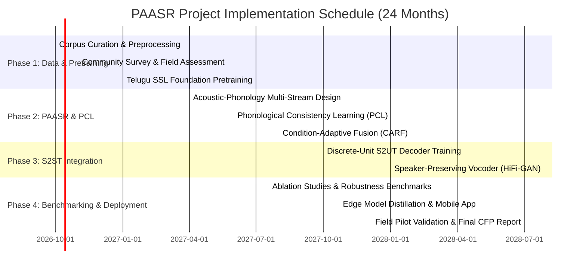

# Research Project Proposal (CFP Submission Draft)

---

## 1. Project Metadata & Overview

- **Project Title:** A Phonology-Aware Adaptive Speech Representation Framework for Robust Low-Resource Telugu-to-English Direct Speech-to-Speech Translation
- **Acronym:** **PAASR** (Phonology-Aware Adaptive Speech Representation)
- **Primary Domain:** Artificial Intelligence, Spoken Language Processing, Low-Resource Language Technologies, Human–Computer Interaction
- **Target Beneficiaries:** Telugu-speaking rural and semi-urban communities, farmers, Telugu-medium students, senior citizens, healthcare patients, migrant workers, and small business owners.
- **Translational Focus:** Direct Speech-to-Speech Translation (S2ST) eliminating intermediate text transcriptions, preserving paralinguistic cues and speaker identity while achieving acoustic robustness against regional accents, ambient noise, and speaking-rate variability.

---

## 2. Application & Community Impact

### 2.1 Socio-Economic Problem & Community Profile
Telugu is spoken by over 95 million people worldwide, predominantly in Andhra Pradesh, Telangana, and the Yanam district of Puducherry. Despite being one of the classical languages of India with rich morphological and phonetic complexities, it remains severely under-resourced in direct voice-to-voice translation systems.

A substantial proportion of rural and semi-urban Telugu native speakers encounter severe linguistic friction when accessing:
1. **Specialized Healthcare & Telemedicine:** Communicating complex symptoms to non-Telugu specialist physicians.
2. **Agricultural Advisory & Marketplaces:** Understanding English-dominated agricultural intelligence, national MSP policies, and agro-tech advisories.
3. **Higher Education & Vocational Training:** Telugu-medium students navigating English academic lectures, interviews, and laboratory instructions.
4. **Administrative & Public Services:** Interacting with central government portals, banking services, and migration/employment documentation.

### 2.2 Community Benefit & Deployment Vision
Conventional digital interfaces require either literate keyboard input (typing in Telugu script or phonetic English transliteration) or rely on cascaded ASR $\rightarrow$ MT $\rightarrow$ TTS systems that exhibit cascading compounding errors, high latency (often $>3.5$ s), and robotic generic voices. 

The proposed PAASR system provides:
- **Zero-Typing Voice Interface:** Natural continuous Telugu spoken input directly translated into spoken English.
- **Speaker & Acoustic Fidelity:** Preserves the user’s voice characteristics, vocal effort, and emotional cadence.
- **Edge/Mobile Portability:** Lightweight deployment footprint through knowledge distillation and discrete unit quantization, operable on mid-tier Android smartphones and edge kiosks in rural Common Service Centres (CSCs).

---

## 3. Problem Statement & Research Gap

### 3.1 The Cascade Dilemma vs. Direct S2ST
Traditional speech translation relies on a three-stage cascade:
$$\text{Source Speech } X_{\text{TE}} \xrightarrow[\text{ASR}]{} \text{Source Text } Y_{\text{TE}} \xrightarrow[\text{MT}]{} \text{Target Text } Y_{\text{EN}} \xrightarrow[\text{TTS}]{} \text{Target Speech } X_{\text{EN}}$$

This cascade suffers from three fundamental bottlenecks:
1. **Error Compounding:** A recognition error in ASR (e.g., misrecognizing a regional dialectal inflection or colloquial particle in Telugu) irrevocably corrupts MT and TTS.
2. **Acoustic & Paralinguistic Loss:** Expressive cues (prosody, emotional tone, speaker identity, urgency) are discarded when speech is reduced to unpunctuated text.
3. **Modular Latency & Compute Footprint:** Running three disjoint neural models requires substantial memory and multi-pass latency, rendering real-time conversational exchange unfeasible.

### 3.2 Unique Linguistic Challenges in Telugu
- **Agglutinative & Morphologically Rich:** Telugu words are formed by chaining suffixes to root morphemes, creating high out-of-vocabulary (OOV) rates for standard text tokenizers.
- **Phonological Nuances:** Telugu features distinct contrastive retroflex consonants (/ʈ/, /ɖ/, /ɳ/), dental vs. retroflex stops, vowel length contrasts (e.g., *ka* vs. *kā*), and vowel harmony. Unaware representations conflate these under noisy conditions or regional accents (e.g., Rayalaseema vs. Coastal Andhra vs. Telangana dialects).
- **Data Scarcity:** Supervised Telugu–English parallel speech data is scarce. The recent TeluguST-46 benchmark (Akkiraju et al., 2025) provides 46 hours of verified speech, highlighting the urgent need for self-supervised representation learning coupled with explicit inductive biases.

### 3.3 Research Gap Summary
| Existing Paradigm | Limitations / Unresolved Gaps |
| :--- | :--- |
| **Multilingual Foundation Models** (e.g., SeamlessM4T) | Resource-heavy; disproportionately trained on high-resource Indo-European languages; Telugu representations lack fine-grained phonological inductive bias. |
| **Phonology-Guided S2ST** (e.g., Ochieng & Kaburu, 2025) | Demonstrated on African languages; lacks adaptive dynamic gating across acoustic, speaker, and noise conditions. |
| **Speaker-Preserving S2UT** (e.g., Zhou et al., 2026) | Evaluated on European pairs (ES-EN, FR-EN); separates speaker adaptation from phonetic invariant modeling. |
| **Unsupervised / Textless S2ST** (e.g., ZeST, Nguyen & Sakti, 2025) | Requires extensive mining; lacks robustness under real-world rural acoustic noise (tractor noise, market babble, low-cost microphones). |
| **The Unmet Need** | A unified framework that **jointly models Telugu phonological consistency** while **dynamically adapting** to speaker identity, regional accents, ambient noise, and speaking rates. |

---

## 4. Research Objectives

1. **Self-Supervised Telugu Speech Representation Learning:** Pretrain a high-capacity acoustic-phonetic foundation encoder utilizing unannotated Telugu audio corpora ($>2,500$ hours from IndicTTS, IIIT-H, OpenSLR, and public broadcasts) using masked contrastive predictive coding.
2. **Design of the PAASR Architecture:** Construct a multi-stream representation module decomposing speech into acoustic ($F_{\text{acoustic}}$), phonological ($F_{\text{phonology}}$), and contextual ($F_{\text{context}}$) latent streams.
3. **Phonological Consistency Learning (PCL):** Implement contrastive invariance objectives ensuring phonetically equivalent Telugu utterances yield invariant semantic representations irrespective of regional accent, pitch, or speaking rate.
4. **Condition-Adaptive Representation Fusion (CARF):** Engineer a learnable soft-gating mechanism that dynamically weights the multi-stream representations conditioned on real-time estimates of speaker identity, accent category, SNR, and speaking rate.
5. **Direct Speech-to-Speech Translation Pipeline:** Couple the PAASR encoder with a discrete-unit target sequence-to-sequence decoder and unit vocoder (HiFi-GAN), achieving end-to-end Telugu-to-English translation preserving speaker identity.
6. **Empirical Benchmarking & Community Field Validation:** Validate the framework against TeluguST-46 baselines across BLEU, chrF++, UTMOS, and speaker cosine similarity; conduct human-in-the-loop community evaluation in semi-urban and rural centers.

---

## 5. System Architecture & Methodology

### 5.1 Architecture Comparison

#### Figure 1: Conventional Cascade System (Baseline)

#### Figure 2: Proposed PAASR Direct Speech-to-Speech Translation Framework

---

### 5.2 Mathematical Formulation

Let the source Telugu speech waveform be denoted by $X \in \mathbb{R}^{T_w}$, sampled at 16 kHz.

#### 1. Self-Supervised Backbone & Decomposition
The raw waveform is transformed by a multi-layer 1D convolutional feature encoder followed by a Transformer backbone:
$$H = \text{Transformer}(\text{ConvNet}(X)) \in \mathbb{R}^{T \times D}$$
where $T$ represents temporal frames (stride $\approx 20\text{ ms}$) and $D$ is the embedding dimension ($D = 768$ or $1024$).

The representation is projected into three distinct subspaces:
1. **Acoustic Representation:** 
   $$F_{\text{acoustic}} = \text{Conv1D}_{k=3}(\text{LayerNorm}(H)) \in \mathbb{R}^{T \times d}$$
   capturing instantaneous harmonic, pitch, and energy profiles.
2. **Phonological Representation:** 
   $$F_{\text{phonology}} = \text{MultiHeadAttention}(Q=H, K=P_{\text{anchor}}, V=P_{\text{anchor}}) \in \mathbb{R}^{T \times d}$$
   where $P_{\text{anchor}}$ denotes a learnable codebook initialized with International Phonetic Alphabet (IPA) articulatory features specific to Telugu phonemes (e.g., dental stops /t̪/, retroflex stops /ʈ/, aspirated stops /dʰ/, retroflex lateral /ɭ/).
3. **Contextual Representation:** 
   $$F_{\text{context}} = \text{TransformerLayer}(H) \in \mathbb{R}^{T \times d}$$
   capturing long-range semantic and syntactic dependencies.

#### 2. Condition Vector Estimation
A parallel pooling network extracts condition characteristics from $H$:
$$C = \left[ C_{\text{speaker}} \,\|\, C_{\text{accent}} \,\|\, C_{\text{noise}} \,\|\, C_{\text{rate}} \right] \in \mathbb{R}^{d_c}$$
- $C_{\text{speaker}} \in \mathbb{R}^{192}$: Extracted via an attentive statistics pooling ECAPA-TDNN sub-network.
- $C_{\text{accent}} \in \mathbb{R}^{4}$: Soft posterior over the 4 major Telugu regional dialects (Coastal Andhra, Rayalaseema, Telangana, Uttarandhra).
- $C_{\text{noise}} \in \mathbb{R}^{2}$: Estimated frame-level SNR and spectral centroid dispersion.
- $C_{\text{rate}} \in \mathbb{R}^{1}$: Moraic duration estimator derived from peak-to-valley energy cadence.

#### 3. Condition-Adaptive Representation Fusion (CARF)
To dynamically route feature relevance under adverse noise or non-standard accents, a learnable adaptive gate is computed for each frame $t$:
$$u_t = \left[ F_{\text{acoustic}, t} \,\|\, F_{\text{phonology}, t} \,\|\, F_{\text{context}, t} \,\|\, C \right] \in \mathbb{R}^{3d + d_c}$$
$$\mathbf{g}_t = W_2 \cdot \text{GeLU}\left(W_1 u_t + b_1\right) + b_2 \in \mathbb{R}^3$$
$$\boldsymbol{\alpha}_t = \text{Softmax}\left(\frac{\mathbf{g}_t}{\tau}\right) = [\alpha_{t, \text{ac}}, \alpha_{t, \text{ph}}, \alpha_{t, \text{ctx}}]^\top$$
where $\tau > 0$ is a temperature hyperparameter. The unified PAASR representation is computed as:
$$F_{\text{PAASR}, t} = \alpha_{t, \text{ac}} F_{\text{acoustic}, t} + \alpha_{t, \text{ph}} F_{\text{phonology}, t} + \alpha_{t, \text{ctx}} F_{\text{context}, t}$$

#### 4. Phonological Consistency Learning (PCL)
To enforce that phonetic content remains invariant across different speakers, recording equipment, and background noises, we enforce an InfoNCE contrastive alignment loss. Given an utterance $X^{(i)}$ and a perturbed / cross-speaker counterpart $X^{(j)}$ sharing identical phonetic content:
$$\mathcal{L}_{\text{PCL}} = - \frac{1}{T} \sum_{t=1}^{T} \log \frac{\exp\left(\text{sim}\left(F_{\text{phonology}, t}^{(i)}, F_{\text{phonology}, \pi(t)}^{(j)}\right) / \tau_p\right)}{\sum_{k \in \mathcal{N}} \exp\left(\text{sim}\left(F_{\text{phonology}, t}^{(i)}, F_{\text{phonology}, \pi(t)}^{(k)}\right) / \tau_p\right)}$$
where $\text{sim}(\mathbf{a}, \mathbf{b}) = \frac{\mathbf{a}^\top \mathbf{b}}{\|\mathbf{a}\| \|\mathbf{b}\|}$, $\pi(t)$ is a monotonic alignment derived via dynamic time warping (DTW), and $\mathcal{N}$ is an in-batch negative sample set.

#### 5. Joint Multi-Task Optimization Objective
The end-to-end model is optimized via a composite loss:
$$\mathcal{L}_{\text{total}} = \lambda_1 \mathcal{L}_{\text{S2UT}} + \lambda_2 \mathcal{L}_{\text{PCL}} + \lambda_3 \mathcal{L}_{\text{SSL}} + \lambda_4 \mathcal{L}_{\text{spk}}$$
- $\mathcal{L}_{\text{S2UT}}$: Cross-entropy loss over discrete target English speech units ($K=1000$ clusters from target English HuBERT representations).
- $\mathcal{L}_{\text{PCL}}$: Phonological consistency invariance loss.
- $\mathcal{L}_{\text{SSL}}$: Masked acoustic frame reconstruction loss on unlabelled Telugu speech.
- $\mathcal{L}_{\text{spk}}$: Cosine distance loss between source $C_{\text{speaker}}$ and synthesized target speech speaker embedding.

---

## 6. Literature Survey – Recent Journal Studies

| Author(s) / Year | Title / Journal | Core Methodology | Key Outcome | Research Gap Identified & PAASR Advantage |
| :--- | :--- | :--- | :--- | :--- |
| **Gupta, Dutta, & Maurya (2025)** | Direct speech-to-speech neural machine translation: A survey *(Speech Communication, 175, 103317)* | Review of discrete units, multi-task learning, segmentation, evaluation, and latency bottlenecks. | Proves direct S2ST reduces cascade error propagation, but trails cascade in low-resource settings. | Survey identifies low-resource parallel data as open bottleneck; does not propose a Telugu architecture. |
| **Ochieng & Kaburu (2025)** | Phonology-guided speech-to-speech translation for African languages *(Speech Communication, 174, 103287)* | Prosody/phonology alignment (SPaDA) + diffusion-based SegUniDiff with speaker encoders. | Superior BLEU and lower speaker error rate in near-real-time African language tasks. | Focused on Niger-Congo/Bantu phonology; lacks adaptive dynamic gating for Indian retroflex vowels/consonants. |
| **Zhou, Ito, & Nose (2026)** | Preserving speaker information in direct S2ST with non-autoregressive generation and pre-training *(Computer Speech & Language, 97, 101902)* | SSL pretraining for speaker adapter and unit-to-mel conversion; feature-fusion non-autoregressive decoding. | Substantial gains in UTMOS (+0.35) and speaker cosine similarity over SC-S2UT on ES/FR/DE-EN. | High-resource European languages only; does not handle low-resource morphological or dialectal degradation. |
| **Nguyen & Sakti (2025)** | ZeST: Zero-Resourced Speech-to-Speech Translation for Unknown, Unpaired Languages *(IEEE Access, 13, 8638–8648)* | Visually grounded speech representations discovering pseudo-pairs; textless discrete-unit S2ST. | Demonstrates textless S2ST feasibility without any bilingual parallel text. | Relies on paired images; lacks explicit phonology modeling and degrades under severe acoustic noise. |
| **Gong, Xu, & Zhao (2025)** | Tibetan–Chinese speech-to-speech translation based on discrete units *(Scientific Reports, 15, 2592)* | HuBERT discrete units, S2UT encoder-decoder, SSL pretraining, auxiliary multi-tasking. | Viable low-resource Sino-Tibetan S2ST with competitive semantic preservation. | Language-specific rule sets; does not dynamically adapt representations across varying speaker rates or noises. |
| **SEAMLESS Team (2025)** | Joint speech and text machine translation for up to 100 languages *(Nature, 637, 587–593)* | Massive foundation architecture (SeamlessM4T) with shared multilingual latent space and UnitY multi-stage decoding. | Establishes state-of-the-art multilingual S2ST across 100 languages. | Prohibitive computational size (billions of parameters); poor zero-shot performance on low-resource rural Telugu accents. |
| **Feng, Zhao, Zong, & Xu (2024)** | Adaptive multi-task learning for speech to text translation *(EURASIP J. Audio Speech Music Process.)* | Optimal-transport alignment between speech and text + dynamic loss-reweighting across ASR, MT, and ST. | Consistent BLEU improvements on Tibetan-Chinese, EN-DE, and EN-FR. | Restricted to speech-to-text; adaptation operates strictly at the loss level rather than within acoustic feature layers. |
| **Liu, Yang, & Qu (2024)** | Exploration of Whisper fine-tuning strategies for low-resource ASR *(EURASIP J. Audio Speech Music Process., 29)* | Benchmarked LoRA, prefix-tuning, adapter modules, and bitfit across 7 low-resource tongues. | Parameter-efficient adapters prevent catastrophic forgetting while matching full fine-tuning. | Targets speech recognition only; does not address speech-to-speech transfer or phonological invariance. |
| **Niu, Chen, Qu, Hu, & Liu (2025)** | Parameter-efficient adaptation with multi-channel adversarial training for far-field ASR *(EURASIP J. Audio Speech Music Process., 19)* | Speech prefix tuning + multi-channel adversarial discriminator to induce channel invariance. | Outperformed LoRA under severe room reverberation and distance degradation. | Validated only on far-field ASR; does not solve cross-lingual phonetic mapping or prosody preservation. |
| **Deng & Woodland (2024)** | Decoupled structure for improved adaptability of end-to-end models *(Speech Communication, 163, 103109)* | Decoupled acoustic and linguistic modules enabling plug-and-play internal language model swapping. | Significant relative WER reduction across cross-domain ASR and E2E speech translation. | Modularity focuses on language model swapping; lacks unified phonology-conditioned acoustic gating. |
| **Akkiraju et al. (2025)** *(Benchmark Reference)* | TeluguST-46: A Benchmark Corpus and Comprehensive Evaluation for Telugu-English ST *(Findings of IJCNLP-AACL, 1268–1275)* | 46 hours manually verified Telugu-English speech translation corpus (30h train, 8h dev, 8h test). | Proved end-to-end models can challenge cascade systems; provided standard benchmarks. | Highlights severe data scarcity; reinforces that baseline E2E models suffer from accent and noise sensitivity. |

---

## 7. Experimental Setup, Tools & Datasets

### 7.1 Software & Hardware Infrastructure
- **Operating Framework:** PyTorch 2.3+, CUDA 12.x, Torchaudio, HuggingFace `transformers`.
- **Speech Processing & Augmentation:** `librosa`, `torchaudio`, `audiomentations` (simulating room impulse responses, babble noise, agricultural machinery hum, and speed perturbations from $0.85\times$ to $1.15\times$).
- **Vocoding & Synthesis:** HiFi-GAN discrete unit vocoder, Fairseq S2UT toolkit.
- **Hardware Profile:** 4 $\times$ NVIDIA RTX 4090 / A100 (80GB) GPUs; target inference quantized on ONNX Runtime for edge deployment on Snapdragon 8-series / Jetson Orin Nano.

### 7.2 Datasets & Partitioning
1. **Unlabeled Telugu Speech (SSL Pretraining):** 
   - IndicTTS Telugu Speech Corpus (~40 hours)
   - OpenSLR Telugu Broadcast Speech (~65 hours)
   - IIIT-H IndicSpeech Telugu subset (~150 hours)
   - Filtered YouTube agricultural/educational Telugu speech (~2,000 hours)
2. **Supervised Parallel Telugu–English Speech Translation:**
   - **TeluguST-46 (Akkiraju et al., 2025):** 46 hours total (30h train, 8h dev, 8h test).
   - Augmented with synthetic target audio via TTS on MuST-C / IndicTrans parallel text where required.

---

## 8. Comprehensive Evaluation Protocol

| Evaluation Dimension | Primary Metrics | Benchmark Baselines | Evaluation Objective |
| :--- | :--- | :--- | :--- |
| **Translation Quality** | BLEU (sacreBLEU), chrF++, METEOR, COMET | 1. Whisper-Large-v3 + IndicTrans2 + VITS 2. SeamlessM4T-Medium 3. Baseline S2UT | Measure translation accuracy and syntactic/semantic preservation from spoken Telugu to spoken English. |
| **Speech Quality & Naturalness** | UTMOS (neural MOS), NISQA, Human MOS (1–5) | Ground-truth English speech & baseline S2UT | Assess speech naturalness, intelligibility, absence of artifacts, and robotic cadence. |
| **Speaker Preservation** | Cosine Similarity (ECAPA-TDNN), Equal Error Rate (EER) | Ground-truth source Telugu voice embeddings | Verify that target English speech accurately preserves the pitch, gender, and vocal identity of the Telugu speaker. |
| **Robustness Under Adverse Conditions** | Relative $\Delta\text{BLEU}$ and $\Delta\text{WER}$ at SNR 0 dB, 5 dB, 15 dB; 4 regional accents | Standard models without CARF / PCL | Measure generalization across regional dialects and ambient background noise. |
| **Operational Efficiency** | Real-Time Factor (RTF), End-to-end Latency (ms), Model Parameters (M) | Cascaded system vs. SeamlessM4T | Ensure practical feasibility for edge and low-latency mobile deployment ($<800\text{ ms}$). |

---

## 9. Community Validation & Survey Protocol

To satisfy institutional CFP community engagement criteria, a field study is conducted across 3 semi-urban and rural mandals in Andhra Pradesh and Telangana.

### 9.1 Community Survey Questionnaire (10 Quantitative Questions)
1. **Communication Frequency:** How often do you need to communicate with English-speaking officials, doctors, or teachers?  
   *(Daily / Weekly / Monthly / Rarely)*
2. **Comprehension Difficulty:** When an official or physician speaks in English, how difficult is it for you to understand?  
   *(Extremely Difficult [5] $\rightarrow$ Very Easy [1])*
3. **Priority Domain:** Which sector would benefit you most from real-time Telugu-to-English voice translation?  
   *(Healthcare / Agriculture & Mandi / Education / Government Services / Employment / Banking)*
4. **Input Modality Preference:** Do you prefer speaking naturally in Telugu over typing in Telugu script or English letters?  
   *(Strongly Prefer Speaking / Prefer Typing / Indifferent)*
5. **Dialect Importance:** How crucial is it that the system understands your local regional Telugu slang/accent?  
   *(Critical / Somewhat Important / Not Important)*
6. **Noisy Environment Resilience:** How often do you need to translate in noisy places (roads, markets, fields, bus stations)?  
   *(Always / Often / Occasionally / Never)*
7. **Spoken Output Value:** Would you prefer the application to speak out the English translation rather than just showing text on screen?  
   *(Yes, Spoken Voice Only / Both Voice & Text / Text Only)*
8. **Latency Tolerance:** What is the maximum acceptable delay between speaking Telugu and hearing the English translation?  
   *($<1$ second / 1–2 seconds / 3–5 seconds / $>5$ seconds)*
9. **Confidence Indicator:** Would you trust the system more if it displayed an indicator showing how confident it is about the translation?  
   *(Yes, Greatly / Somewhat / No)*
10. **Community Adoption:** If a free voice-to-voice translation app were provided on your phone, would you use it regularly?  
    *(Definitely Yes / Probably / Unlikely / No)*

---

## 10. Project Work Plan, Milestones & Deliverables

---

## 11. Complete Bibliography & References

- **[R1]** Gupta, M., Dutta, M., & Maurya, C. K. (2025). Direct speech-to-speech neural machine translation: A survey. *Speech Communication*, 175, 103317. https://doi.org/10.1016/j.specom.2025.103317
- **[R2]** Ochieng, P., & Kaburu, D. (2025). Phonology-guided speech-to-speech translation for African languages. *Speech Communication*, 174, 103287. https://doi.org/10.1016/j.specom.2025.103287
- **[R3]** Zhou, R., Ito, A., & Nose, T. (2026). Preserving speaker information in direct Speech-to-Speech Translation with non-autoregressive generation and pre-training. *Computer Speech & Language*, 97, 101902. https://doi.org/10.1016/j.csl.2025.101902
- **[R4]** Nguyen, L. T., & Sakti, S. (2025). ZeST: A Zero-Resourced Speech-to-Speech Translation Approach for Unknown, Unpaired, and Untranscribed Languages. *IEEE Access*, 13, 8638–8648. https://doi.org/10.1109/ACCESS.2025.3527012
- **[R5]** Gong, Z., Xu, X., & Zhao, Y. (2025). Tibetan–Chinese speech-to-speech translation based on discrete units. *Scientific Reports*, 15, 2592. https://doi.org/10.1038/s41598-025-85782-w
- **[R6]** Seamless Communication Team. (2025). Joint speech and text machine translation for up to 100 languages. *Nature*, 637, 587–593. https://doi.org/10.1038/s41586-024-08359-z
- **[R7]** Feng, X., Zhao, Y., Zong, W., & Xu, X. (2024). Adaptive multi-task learning for speech to text translation. *EURASIP Journal on Audio, Speech and Music Processing*, 2024, 45. https://doi.org/10.1186/s13636-024-00359-1
- **[R8]** Liu, Y., Yang, X., & Qu, D. (2024). Exploration of Whisper fine-tuning strategies for low-resource ASR. *EURASIP Journal on Audio, Speech and Music Processing*, 2024, 29. https://doi.org/10.1186/s13636-024-00349-3
- **[R9]** Niu, T., Chen, Y., Qu, D., Hu, H., & Liu, C. (2025). Parameter-efficient adaptation with multi-channel adversarial training for far-field speech recognition. *EURASIP Journal on Audio, Speech and Music Processing*, 2025, 19. https://doi.org/10.1186/s13636-025-00406-5
- **[R10]** Deng, K., & Woodland, P. C. (2024). Decoupled structure for improved adaptability of end-to-end models. *Speech Communication*, 163, 103109. https://doi.org/10.1016/j.specom.2024.103109
- **[R11]** Akkiraju, B., Bandarupalli, S., Sambangi, S., Saraswathi, R. V., Ravuri, V., & Vuppala, A. (2025). TeluguST-46: A Benchmark Corpus and Comprehensive Evaluation for Telugu-English Speech Translation. *Findings of the Association for Computational Linguistics: IJCNLP-AACL 2025*, 1268–1275. https://doi.org/10.18653/v1/2025.findings-ijcnlp.77
